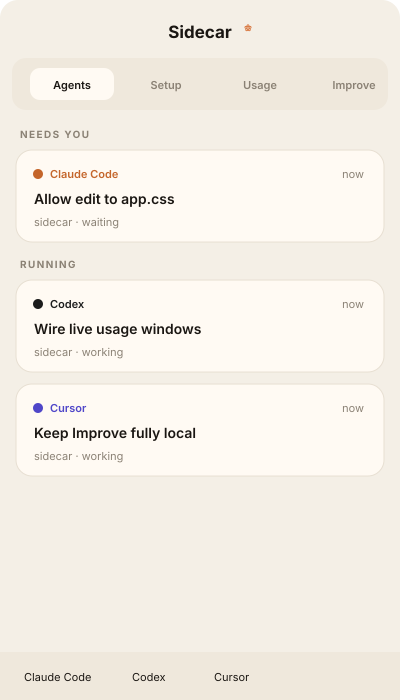
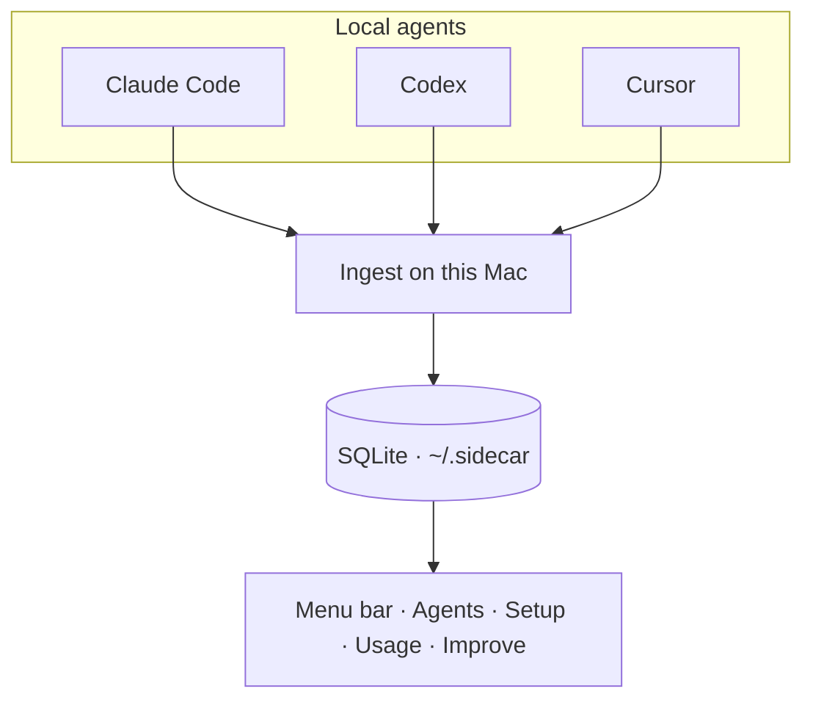

# Sidecar

<p align="center">
  
</p>

<p align="center"><strong>Stop guessing which agent is waiting on you.</strong></p>

<p align="center">Sidecar lives in the macOS menu bar and reads the trail <strong>Claude Code</strong>, <strong>Codex</strong>, and <strong>Cursor</strong> already leave on this Mac. No new account. No cloud copy of your chats.</p>

<p align="center">
  <a href="https://github.com/Avik-creator/sidecar/releases">Get the macOS build</a>
  ·
  <a href="#install">Run from source</a>
</p>

<p align="center">
  
</p>

## Why this exists

You already run more than one agent. The permission prompt is in the window you are not looking at. Usage is split across three dashboards. The same “don’t do that” correction shows up in every repo.

Other tools ask you to open another website and trust another copy of your transcripts. Sidecar does not. It watches local files, then shows who needs you, what is wired, what you spent, and which corrections are worth turning into rules.

## What you get

**Agents.** See Claude Code, Codex, and Cursor in one list — running, waiting on you, or done. Sidecar is a companion, not a fourth IDE.

**Setup.** Skills, rules, hooks, and MCP servers from the agents on this machine, including Claude Code, Codex, Cursor, Gemini CLI, Cline, Windsurf, and others already on disk.

**Usage.** Exact local token history plus live plan windows from the provider you are already signed into. One By day list, in your timezone.

**Improve.** Repeated corrections, proposed as rule diffs you apply yourself. Nothing is sent to a Sidecar model.

## How it works

1. Your agents write transcripts locally. Sidecar never starts them for you.
2. An ingest pass indexes those files into `~/.sidecar/sidecar.sqlite`.
3. The menu bar panel stays current. There is no localhost server and no `Access-Control-Allow-Origin`.



## Privacy

Sidecar is local-first on purpose.

| Reads | Never writes |
| --- | --- |
| `~/.claude` transcripts and OAuth files | `.credentials.json` |
| `~/.codex` transcripts and `auth.json` | Codex `auth.json` |
| Cursor `state.vscdb` | Cursor SQLite |
| macOS Keychain items the agents already stored | refreshed tokens to disk |

The only files Sidecar creates are under `~/.sidecar/`.

## FAQ

**Is this only for Cursor?**
No. Sessions, spend, and live plan windows cover Claude Code, Codex, and Cursor. Setup also indexes skills and rules from other local agents.

**Do I paste a Sidecar key?**
No. Sidecar reads the login the agent already has. Refresh stays in memory.

**Will it upload my repo?**
No. Improve clusters corrections on this Mac. You apply the diff yourself.

**Is the orange flower Electron’s icon?**
No. That mark is Sidecar — the same SVG in the menu bar, the app icon, and this page.

## Install

macOS, Node 22+. Grab a build from [Releases](https://github.com/Avik-creator/sidecar/releases), or run from source:

```bash
git clone https://github.com/Avik-creator/sidecar.git
cd sidecar
npm install
npm test
npm run dev
```

`npm run dev` puts the Sidecar mark in the menu bar. Click it for the panel. Right-click the icon to quit.

```bash
npm run ingest
npm run sidecar -- usage
npm run sidecar -- improve
```

### Release a build

CI runs typecheck, tests, and `electron-vite build` on every push to `main`. Pushing a version tag packages unsigned arm64 and x64 DMGs:

```bash
git tag v0.1.0
git push origin v0.1.0
```

## CLI

```bash
npx tsx src/cli/index.ts ingest
npx tsx src/cli/index.ts usage --days 30
npx tsx src/cli/index.ts agents
npx tsx src/cli/index.ts setup
```

Hooks should call Sidecar and exit immediately:

```bash
sidecar hook --harness claude --type PermissionRequest --session "$SESSION_ID"
```

Set `SIDECAR_LIVE_USAGE=0` to skip provider probes and keep the local-only usage report.

## Development

```bash
npm run typecheck
npm test
npm run brand
npm run build
```

`npm run brand` rewrites `docs/brand/mark.svg`, `docs/brand/panel.svg`, and `build/icon.png` from the same geometry the app uses.

| Path | Role |
| --- | --- |
| `src/core/ingest` | Claude / Codex / Cursor parsers |
| `src/core/agents` | live session query |
| `src/core/setup` | skills, rules, hooks, MCPs |
| `src/core/usage` | local spend + live plan probes |
| `src/core/improve` | correction clustering |
| `src/shared/mark.ts` | Sidecar flower used by tray, icon, and UI |
| `src/main` | tray, IPC, file watchers |
| `src/renderer` | menu bar panel |
