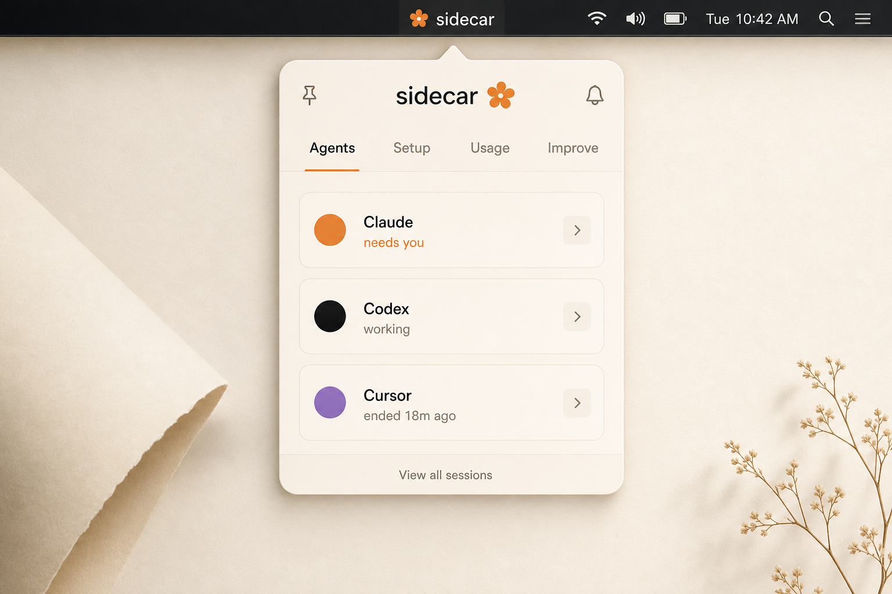
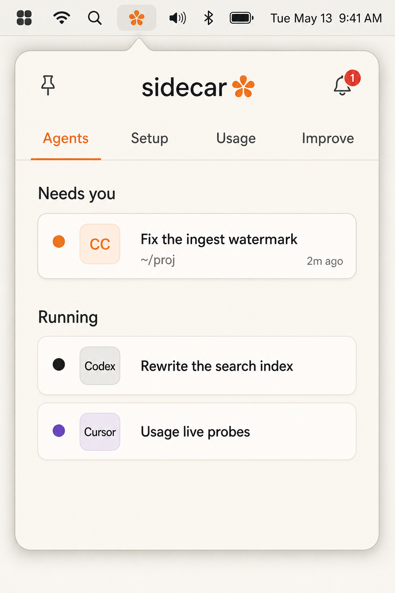
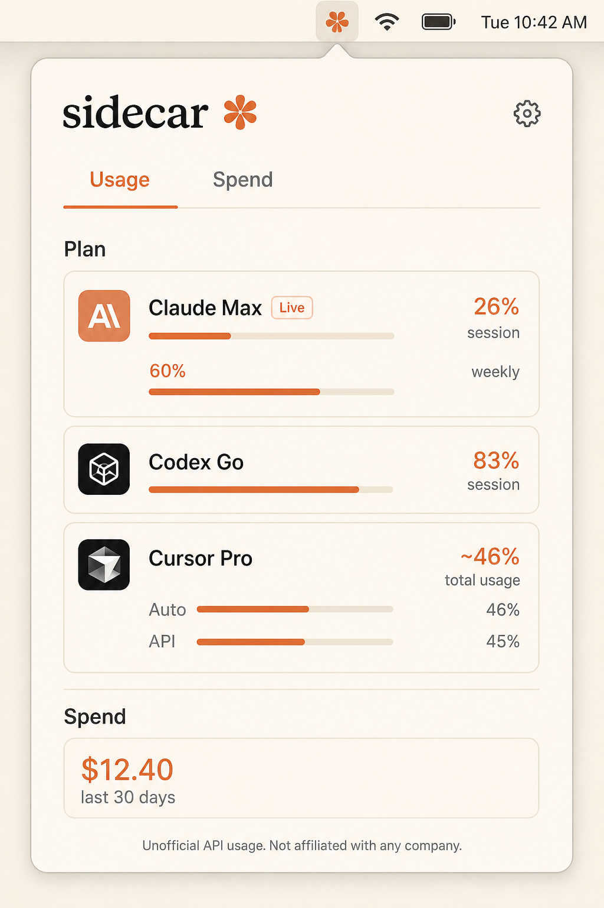
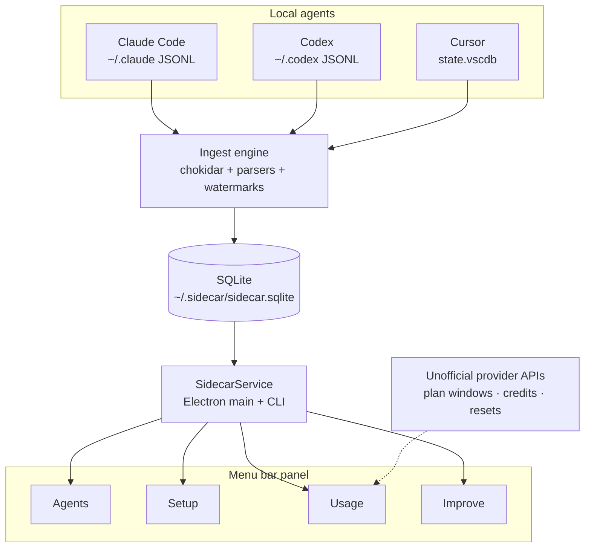

# Sidecar

Local-first companion for **Claude Code**, **Codex**, and **Cursor**.

A macOS menu bar app — no dock icon — that watches local agent transcripts and shows what is running, who needs you, how setup is wired, live plan usage, and repeated corrections worth promoting into rules.

<p align="center">
  
</p>

## Why

Agents already leave a trail on disk. Sidecar reads that trail instead of inventing another cloud dashboard.

- **Agents** — sessions that are running, ended, or waiting on you
- **Setup** — skills, rules, hooks, and MCPs across the tools you actually use
- **Usage** — exact local token history plus live plan windows from provider APIs
- **Improve** — corrections that repeat across sessions, proposed as rule diffs you apply yourself

Data lives in `~/.sidecar/sidecar.sqlite`. Sidecar never rewrites Claude, Codex, or Cursor credentials.

## Screenshots

<p align="center">
  
  &nbsp;
  
</p>

## Architecture



Everything runs in the Electron main process and talks to the renderer over IPC. There is no localhost HTTP server and no `Access-Control-Allow-Origin: *`.

Live usage is a **read-only probe**:

1. Local transcripts remain the source of truth for token and cost history.
2. Provider APIs supply plan limits, utilization, reset times, and credits.
3. Tokens are read from existing files and Keychain items. Refresh stays in memory and is never written back.
4. Responses are cached for five minutes, `Retry-After` is honored, and only normalized snapshots are stored in `~/.sidecar/usage-live.json`.

Those APIs are unofficial. When they change, Sidecar degrades to the last good snapshot instead of guessing.

## Install

macOS, Node 22+. Grab a build from [Releases](https://github.com/Avik-creator/sidecar/releases), or run from source:

```bash
git clone https://github.com/Avik-creator/sidecar.git
cd sidecar
npm install
npm test
npm run dev
```

`npm run dev` puts a Sidecar flower in the menu bar. Click it for the panel. Right-click the icon to quit.

```bash
npm run ingest
npm run sidecar -- usage
npm run sidecar -- improve
```

### Release a build

CI runs typecheck, tests, and `electron-vite build` on every push to `main`. Pushing a version tag packages unsigned arm64 and x64 DMGs and attaches them to a GitHub Release:

```bash
git tag v0.1.0
git push origin v0.1.0
```

## CLI

```bash
npx tsx src/cli/index.ts ingest
npx tsx src/cli/index.ts usage --days 30
npx tsx src/cli/index.ts agents
npx tsx src/cli/index.ts setup
```

Hooks should call Sidecar and exit immediately:

```bash
sidecar hook --harness claude --type PermissionRequest --session "$SESSION_ID"
```

Set `SIDECAR_LIVE_USAGE=0` to skip provider probes and keep the local-only usage report.

## Privacy

Sidecar is local-first on purpose.

| Reads | Never writes |
| --- | --- |
| `~/.claude` transcripts and OAuth files | `.credentials.json` |
| `~/.codex` transcripts and `auth.json` | Codex `auth.json` |
| Cursor `state.vscdb` ItemTable tokens | Cursor SQLite |
| macOS Keychain items the agents already stored | refreshed tokens to disk |

The only files Sidecar creates are under `~/.sidecar/`.

## Development

```bash
npm run typecheck
npm test
npm run build
```

| Path | Role |
| --- | --- |
| `src/core/ingest` | Claude / Codex / Cursor parsers |
| `src/core/agents` | live session query |
| `src/core/setup` | skills, rules, hooks, MCPs |
| `src/core/usage` | local spend + live plan probes |
| `src/core/improve` | correction clustering |
| `src/main` | tray, IPC, file watchers |
| `src/renderer` | menu bar panel |
