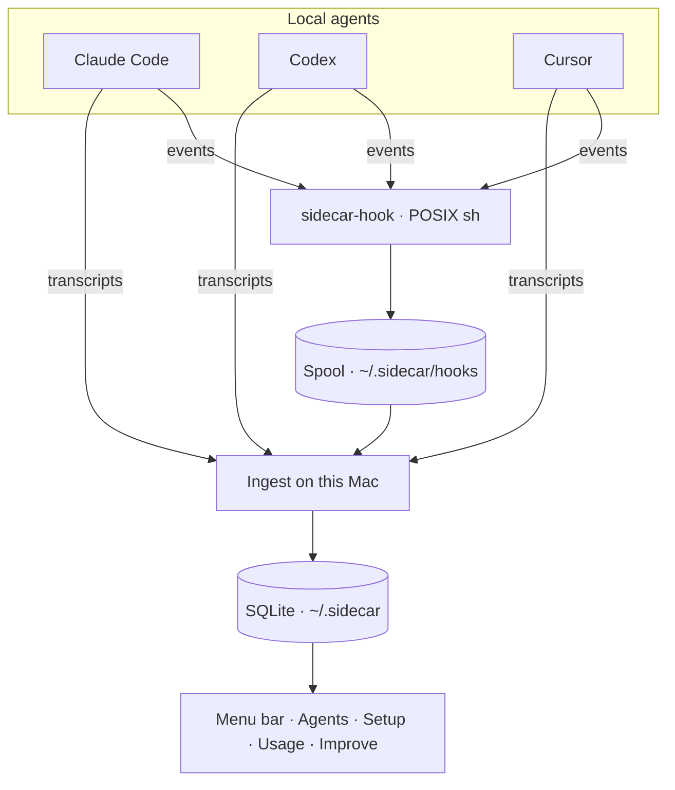

# Sidecar

<p align="center">
  
</p>

<p align="center"><strong>Stop guessing which agent is waiting on you.</strong></p>

<p align="center">Sidecar lives in the macOS menu bar and reads the trail <strong>Claude Code</strong>, <strong>Codex</strong>, and <strong>Cursor</strong> already leave on this Mac. No new account. No cloud copy of your chats.</p>

<p align="center">
  <a href="https://github.com/Avik-creator/sidecar/releases">Get the macOS build</a>
  ·
  <a href="#install">Run from source</a>
</p>

<p align="center">
  
</p>

## Why this exists

You already run more than one agent. The permission prompt is in the window you are not looking at. Usage is split across three dashboards. The same “don’t do that” correction shows up in every repo.

Other tools ask you to open another website and trust another copy of your transcripts. Sidecar does not. It watches local files, then shows who needs you, what is wired, what you spent, and which corrections are worth turning into rules.

## What you get

**Agents.** See Claude Code, Codex, and Cursor in one list — running, waiting on you, or done. Sidecar is a companion, not a fourth IDE.

**Setup.** Skills, rules, hooks, and MCP servers from the agents on this machine, including Claude Code, Codex, Cursor, Gemini CLI, Cline, Windsurf, and others already on disk.

**Usage.** Exact local token history plus live plan windows from the provider you are already signed into. One By day list, in your timezone.

**Improve.** Repeated corrections, proposed as rule diffs you apply yourself. Off until you turn it on, and nothing is sent to a Sidecar model.

## How it works

Sidecar reads two different things, for two different reasons.

**Transcripts tell it what happened.** Your agents write them locally anyway. An ingest pass indexes them into `~/.sidecar/sidecar.sqlite` — sessions, turns, token counts.

**Hooks tell it what is happening now.** A transcript cannot answer "is this agent waiting on me?". A `Stop` line means the model stopped emitting tokens, not that the turn ended, and an unanswered tool call looks exactly like a permission prompt nobody has answered. So Sidecar does not guess. Each agent reports its own state through a hook, and that is the only thing allowed to set a session's state. A session that has never reported reads as **Not reporting** rather than something invented.



There is no localhost server and no `Access-Control-Allow-Origin`.

### The spool

The spool is a **drop box**: a folder agents write notes into, and Sidecar picks them up later.

Here is the problem it solves. When Claude Code or Codex hits a permission prompt, it tells Sidecar by running a small script. That script runs *in the middle of your agent's turn* — your agent is sitting there waiting for it to finish. So it has to be fast, and it must never break.

The obvious approach would be to have that script open Sidecar's database and write the update itself. That is bad three ways: it is slow, it fails when Sidecar is not running, and two agents firing at once fight over the same file.

So the script does the least possible work. It writes one tiny file into `~/.sidecar/hooks/` and exits — about 10 ms. Next time Sidecar wakes up, it reads every file in that folder, updates the database, and deletes them.

It is leaving a sticky note on someone's desk instead of waiting outside their office until they are free. You drop the note and get back to work. They read it when they come in.

That buys three things:

- **Sidecar does not have to be open.** Notes pile up in the folder and are read when you next launch it.
- **Agents cannot collide.** Each event is its own file, so two agents writing at the same moment cannot scribble over each other.
- **Nothing can break your turn.** If the folder is missing or the disk is full, the script gives up quietly and your agent carries on without noticing.

<details>
<summary>The fiddly details, in case you hit them</summary>

**Why POSIX `sh` and not Node.** The helper at `~/.sidecar/bin/sidecar-hook` is a shell script because it sits on your agent's critical path. It costs about 10 ms per event against about 40 ms for the same thing as a Node CLI, and the gap is not the code — a Node process that does nothing at all takes about 22 ms to start, already more than twice the entire hook.

**Why `.tmp` then rename.** Each file is written under a temporary name and then renamed, because rename is atomic. Sidecar never reads a half-written note, and three agents firing at once cannot interleave into one record.

**Why the long filenames.** Sidecar drains the folder in filename order, so the name has to sort by arrival. Names carry a nanosecond timestamp plus the process id. Whole seconds were not enough: two events landed in the same second during testing and replayed in the wrong order.

**Why replay is safe.** Draining applies each event and then deletes the file. Applying the same event twice changes nothing, so a crash midway through costs nothing but a repeat.

**Why it never reports failure.** Every path in the script exits 0. A hook that returns an error is a hook that interrupts your work to tell you a status panel is unhappy, which is not a trade worth making.

</details>

### Turning hooks on

Open **Setup → Reporting** and click Install. Sidecar merges one entry per event into `~/.claude/settings.json`, `~/.codex/hooks.json`, and `~/.cursor/hooks.json`, backing each file up to `~/.sidecar/backups/` first and leaving entries owned by other tools alone. Remove puts them back.

Codex needs one extra step it will not take on your behalf: run `/hooks` inside Codex and trust the Sidecar entries, or they never fire. Setup says so on the Codex row.

## Privacy

Sidecar is local-first on purpose.

| Reads | Never writes |
| --- | --- |
| `~/.claude` transcripts and OAuth files | `.credentials.json` |
| `~/.codex` transcripts and `auth.json` | Codex `auth.json` |
| Cursor `state.vscdb` | Cursor SQLite |
| macOS Keychain items the agents already stored | any token store, anywhere |

**Sidecar never renews an agent's token.** It reads the login your agent already has, and stops there. Renewing would be easy and is a trap: providers can rotate the refresh token, which would leave Sidecar holding the live one and your agent holding a dead one — a usage panel that signs you out of Claude Code. If a token has expired, Sidecar says so and you open the agent, which renews its own.

Sidecar writes inside `~/.sidecar/` only, with two exceptions you ask for explicitly:

- **Installing hooks** edits `~/.claude/settings.json`, `~/.codex/hooks.json`, and `~/.cursor/hooks.json`. Backed up first, other tools' entries untouched, reversible from the same screen.
- **Applying a suggestion** edits the rule file named in the diff you approved. `~/.claude/CLAUDE.md` is excluded unless you opt in, because you maintain that file by hand; repo `CLAUDE.md` and `AGENTS.md` are the normal targets.

## FAQ

**Is this only for Cursor?**
No. Sessions, spend, and live plan windows cover Claude Code, Codex, and Cursor. Setup also indexes skills and rules from other local agents.

**Do I paste a Sidecar key?**
No. Sidecar reads the login the agent already has, and never refreshes it.

**Do I have to install hooks?**
Sidecar works without them — you still get sessions, setup, and spend. You just will not get live state, so agents show as Not reporting instead of running or waiting. Installing takes one click in Setup.

**Will it upload my repo?**
No. Improve clusters corrections on this Mac, and it is off until you turn it on. You apply the diff yourself.

**Is the orange flower Electron’s icon?**
No. That mark is Sidecar — the same SVG in the menu bar, the app icon, and this page.

## Install

macOS, Node 22+. Grab a build from [Releases](https://github.com/Avik-creator/sidecar/releases), or run from source:

```bash
git clone https://github.com/Avik-creator/sidecar.git
cd sidecar
npm install
npm test
npm run dev
```

`npm run dev` puts the Sidecar mark in the menu bar. Click it for the panel. Right-click the icon to quit.

```bash
npm run ingest
npm run sidecar -- usage
npm run sidecar -- improve
```

### Release a build

CI runs typecheck, tests, and `electron-vite build` on every push to `main`. Pushing a version tag packages unsigned arm64 and x64 DMGs:

```bash
git tag v0.1.0
git push origin v0.1.0
```

## CLI

```bash
npx tsx src/cli/index.ts ingest
npx tsx src/cli/index.ts usage --days 30
npx tsx src/cli/index.ts agents
npx tsx src/cli/index.ts setup
```

Hook entries are installed from Setup and point at `~/.sidecar/bin/sidecar-hook`, which takes the harness and event name and reads the payload on stdin. You should not need to write one by hand.

Set `SIDECAR_LIVE_USAGE=0` to skip provider probes and keep the local-only usage report.

## Development

```bash
npm run typecheck
npm test
npm run brand
npm run build
```

`npm run brand` rewrites `docs/brand/mark.svg`, `docs/brand/panel.svg`, and `build/icon.png` from the same geometry the app uses.

| Path | Role |
| --- | --- |
| `src/core/ingest` | Claude / Codex / Cursor parsers |
| `src/core/hooks` | hook helper, installer, and spool drain |
| `src/core/agents` | live session query |
| `src/core/setup` | skills, rules, hooks, MCPs |
| `src/core/usage` | local spend + live plan probes |
| `src/core/improve` | correction clustering |
| `src/shared/mark.ts` | Sidecar flower used by tray, icon, and UI |
| `src/main` | tray, IPC, file watchers |
| `src/renderer` | menu bar panel |
